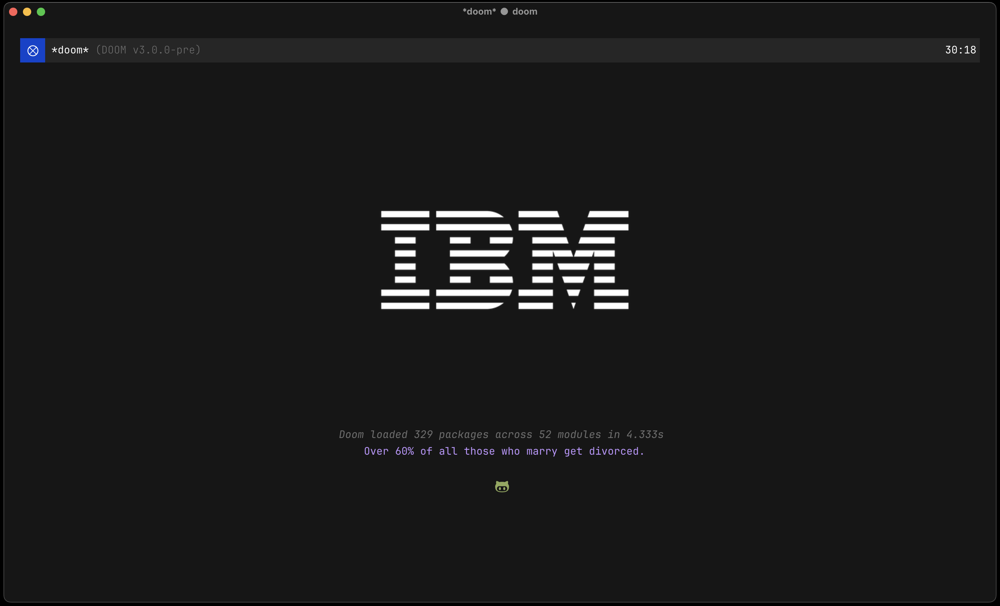

#+title: Doom Emacs Configuration
#+author: x0ba
#+html: 
#+html: 

Here you may find my config. There is only one significant file:
+ =config.org=, my configuration file --- see the [[https://tecosaur.github.io/emacs-config/config.html][HTML]] or [[https://tecosaur.github.io/emacs-config/config.pdf][PDF]] export.

=config.org= /generates/ the [[https://tecosaur.github.io/emacs-config/engraved/init.el.html][init.el]], [[https://tecosaur.github.io/emacs-config/engraved/config.el.html][config.el]], and [[https://tecosaur.github.io/emacs-config/engraved/packages.el.html][packages.el]] files, as well as
about a dozen others.

Other than that, resources are put in [[file:misc/][misc]], and you may find packages I write
in [[file:lisp/][lisp]].
